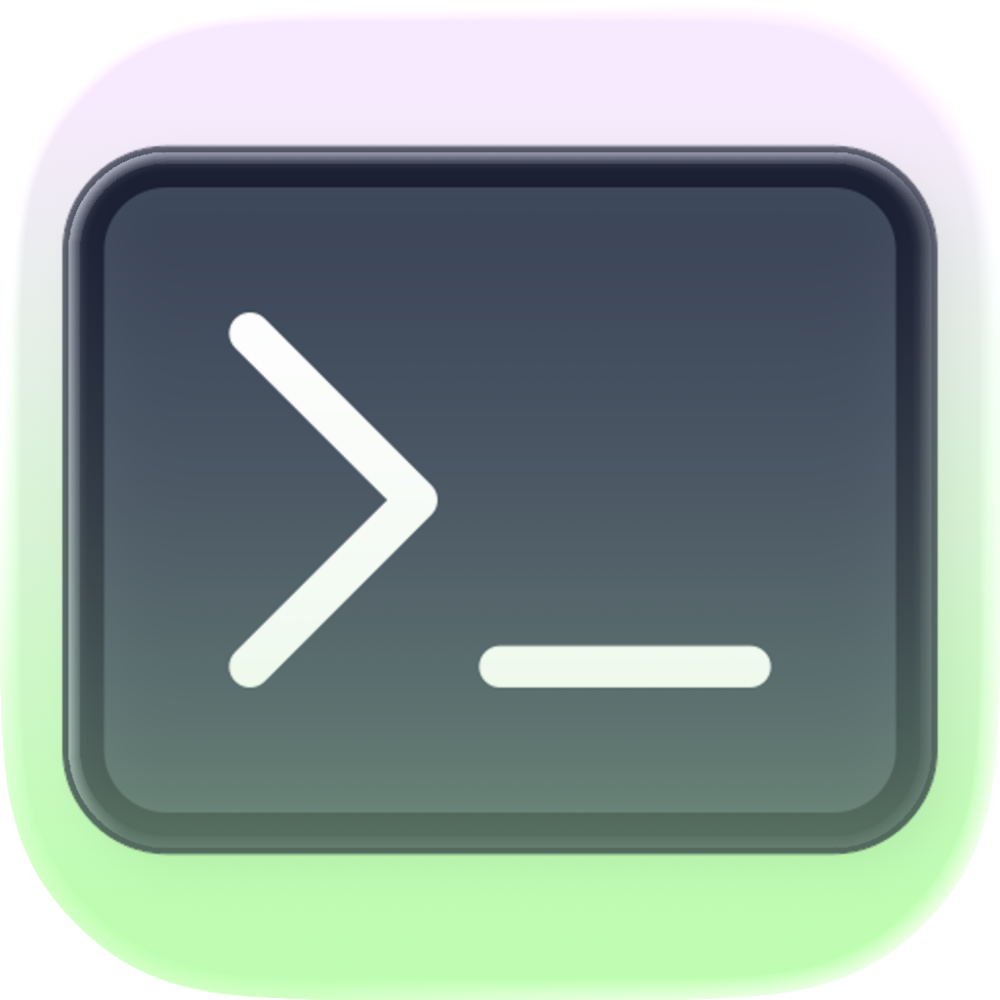

<p align="center">
  
</p>

<h1 align="center">Emacs VTerm.app</h1>

<p align="center">
  <a href="https://github.com/binbinsh/homebrew-emacs-vterm/actions/workflows/emacs-vterm.yml">
    
  </a>
</p>

## About


Emacs VTerm.app as default terminal for macOS. This tap provides a customized Emacs 30 build that launches VTerm by default, bundles the `vterm` package, and ships with a modern macOS app bundle named `Emacs VTerm.app`.

This work builds directly on the excellent `homebrew-emacs-plus` project and reuses its formula structure, patches, and options where appropriate. See upstream for detailed documentation and discussion of build flags and patches.

- Upstream: [`d12frosted/homebrew-emacs-plus`](https://github.com/d12frosted/homebrew-emacs-plus)
- License: MIT (same as upstream)

<br clear="all">

## Install

```bash
brew tap binbinsh/emacs-vterm
brew install emacs-vterm
```

After install, create a link in `/Applications`:

```bash
ln -sf "$(brew --prefix)/opt/emacs-vterm/Emacs VTerm.app" /Applications/
```

### vterm dynamic path/host tracking

To let `libvterm` report directory changes, install the shell integration once:

```bash
git clone https://github.com/akermu/emacs-libvterm.git \
  "${ZSH_CUSTOM:-~/.oh-my-zsh/custom}/plugins/emacs-vterm"
```

Then source it from your `~/.zshrc`:

```bash
source "${ZSH_CUSTOM:-~/.oh-my-zsh/custom}/plugins/emacs-vterm/etc/emacs-vterm-zsh.sh"
```

For remote SSH hosts, do the same setup so OSC-7 codes reach Emacs.


## Behavior

- On GUI launches with no arguments, Emacs opens VTerm by default.
- Right-click the Dock icon and select "New Frame" to create a new VTerm frame.
- The `vterm` package is bundled so VTerm works out of the box.
- Normal behavior is preserved (e.g., `emacs-vterm file.txt`, `--daemon`, `--batch`).

## CLI

One shim is provided that launches the app’s bundled executable:

```bash
emacs-vterm
```
